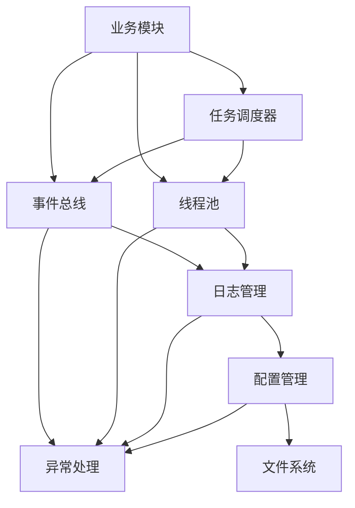

# 雷达信号识别系统知识库

## 1. 项目概述
### 1.1 项目背景
- 项目名称：雷达信号识别系统
- 项目目标：将旧项目迁移到新的DDD架构，保持功能和UI布局不变
- 原有功能：数据导入、数据处理、数据切片、聚类分析、智能识别、结果可视化、参数提取等

### 1.2 技术栈
- 语言：Python
- UI框架：PyQt5
- 数据处理：numpy、pandas
- 机器学习：scikit-learn
- 可视化：matplotlib

## 2. 系统架构

### 2.1 整体架构
系统采用DDD(领域驱动设计)思想，结合MVC架构模式，分为以下层次：
1. 基础设施层 (Infrastructure Layer)
2. 领域层 (Domain Layer)
3. 应用层 (Application Layer)
4. 接口层 (Interface Layer)

### 2.2 目录结构
```
RadarIdentifySystem/
└── radar_system/
    ├── domain/          # 领域层
    ├── application/     # 应用层
    ├── infrastructure/  # 基础设施层
    └── interface/       # 接口层
```

## 3. 实现记录

### 3.1 基础设施层实现

#### 3.1.1 通用基础设施 (common/)

##### 3.1.1.1 异常处理模块 (exceptions.py)
- 状态：✓ 已完成
- 功能：实现统一的异常处理机制，为系统提供标准化的异常定义和处理流程

- 实现文件：
  1. RadarSystemException：基础异常类
     - 功能：所有系统异常的基类，提供基本的异常信息和处理机制
     - 属性：
       - message：异常消息
       - code：异常代码
       - details：详细信息字典
     - 方法：
       - __init__：初始化异常实例
       - __str__：格式化异常信息
       - to_dict：转换为字典格式
  
  2. ValidationError：验证异常
     - 功能：处理数据验证相关的异常
     - 特有属性：
       - field：验证失败的字段
       - value：验证失败的值
       - constraints：验证约束条件
  
  3. ConfigError：配置异常
     - 功能：处理配置加载和解析相关的异常
     - 特有属性：
       - config_file：配置文件路径
       - config_key：配置键
  
  4. ProcessingError：处理异常
     - 功能：处理数据处理过程中的异常
     - 特有属性：
       - process_name：处理过程名称
       - input_data：输入数据描述
  
  5. ResourceError：资源异常
     - 功能：处理资源访问相关的异常
     - 特有属性：
       - resource_type：资源类型
       - resource_id：资源标识
  
  6. ModelError：模型异常
     - 功能：处理模型操作相关的异常
     - 特有属性：
       - model_name：模型名称
       - operation：操作类型
  
  7. RepositoryError：仓储异常
     - 功能：处理数据仓储操作相关的异常
     - 特有属性：
       - repository_name：仓储名称
       - entity_id：实体标识
       - operation：操作类型（如：save、load、delete等）
       - storage_type：存储类型（如：memory、file、database等）
  
  8. UIError：界面异常
     - 功能：处理用户界面相关的异常
     - 特有属性：
       - component：组件名称
       - action：操作类型

- 使用规范：
  1. 异常类型选择：
     - 数据验证失败：使用 ValidationError
     - 配置问题：使用 ConfigError
     - 数据处理错误：使用 ProcessingError
     - 资源访问问题：使用 ResourceError
     - 模型操作错误：使用 ModelError
     - 仓储操作错误：使用 RepositoryError
     - 界面操作问题：使用 UIError
  
  2. 异常信息规范：
     - message：简洁明了的错误描述
     - code：唯一的错误代码
     - details：包含必要的上下文信息
  
  3. 异常处理流程：
     - 捕获具体异常类型
     - 记录详细的错误信息
     - 进行必要的资源清理
     - 返回友好的错误提示

- 最佳实践：
  1. 异常抛出：
     ```python
     if not valid:
         raise ValidationError(
             message="数据格式验证失败",
             code="INVALID_FORMAT",
             details={
                 "field": field_name,
                 "value": field_value,
                 "constraints": constraints
             }
         )
     ```
  
  2. 异常捕获：
     ```python
     try:
         process_data()
     except ValidationError as e:
         logger.error(f"数据验证失败: {e}", exc_info=True)
         return False, str(e)
     except ProcessingError as e:
         logger.error(f"数据处理失败: {e}", exc_info=True)
         return False, str(e)
     except RadarSystemException as e:
         logger.error(f"系统错误: {e}", exc_info=True)
         return False, str(e)
     ```
  
  3. 异常链：
     ```python
     try:
         load_config()
     except FileNotFoundError as e:
         raise ConfigError(
             message="配置文件不存在",
             code="CONFIG_NOT_FOUND",
             details={"file": config_path}
         ) from e
     ```

- 数据流：
  ```mermaid
  graph TD
      A[业务代码] -->|抛出异常| B[异常实例]
      B -->|捕获异常| C[异常处理器]
      C -->|记录日志| D[日志系统]
      C -->|清理资源| E[资源管理]
      C -->|返回错误| F[用户界面]
  ```

##### 3.1.1.2 配置管理模块 (config.py)
- 状态：✓ 已完成
- 功能：实现系统配置的统一管理，包括配置的加载、验证、访问和持久化

- 实现文件：
  1. ConfigManager：配置管理器（单例模式）
     - 功能：统一管理系统配置
     - 属性：
       - _instance：单例实例
       - _initialized：是否已初始化
       - _config_path：配置文件路径
       - data_processing：数据处理配置
       - clustering：聚类配置
       - plotting：绘图配置
       - ui：UI配置
     - 方法：
       - __new__：实现单例模式
       - __init__：初始化配置管理器
       - get_instance：获取单例实例
       - initialize：初始化配置管理器
       - load_config：加载配置文件
       - save_config：保存配置到文件
       - get_config：获取配置项
       - validate_config：验证配置有效性

     - 使用规范：
      1. 配置访问：
         ```python
         # 获取配置管理器实例
         config_manager = ConfigManager.get_instance()
     
         # 访问配置项
         slice_length = config_manager.data_processing.slice_length
         ```
  
      2. 配置初始化：
         ```python
         # 首次初始化
         ConfigManager.initialize("path/to/config.json")
     
         # 后续使用
         config_manager = ConfigManager.get_instance()
         ```

  2. DataProcessingConfig：数据处理配置类
     - 功能：管理数据处理相关的配置
     - 属性：
       - slice_length：切片长度(ms)
       - slice_dim：切片维度
       - data_columns：数据列映射
       - data_units：数据单位配置
       - excel_has_header：Excel文件是否包含表头
       - excel_chunk_size：Excel文件分块读取时的块大小
       - cpu_load：并行处理时的CPU负载百分比（0.0-1.0）
       - use_parallel_reading：是否使用并行读取策略
     - 方法：
       - validate：验证配置有效性
       - to_dict：转换为字典格式
       - get_max_processes：计算基于CPU负载的最大进程数
  
  3. ClusterConfig：聚类配置类
     - 功能：管理聚类分析相关的配置
     - 属性：
       - min_cluster_size：最小聚类大小
       - epsilon_cf：CF维度邻域半径
       - epsilon_pw：PW维度邻域半径
       - min_pts：最小点数
       - pa_weight：PA特征权重
       - dtoa_weight：DTOA特征权重
       - threshold：识别阈值
     - 方法：
       - validate：验证配置有效性
       - to_dict：转换为字典格式
  
  4. PlottingConfig：绘图配置类
     - 功能：管理数据可视化相关的配置
     - 属性：
       - base_configs：基础绘图配置
       - band_configs：波段配置
       - temp_dir：临时文件目录
       - save_dir：保存文件目录
     - 方法：
       - validate：验证配置有效性
       - to_dict：转换为字典格式

  5. UIConfig：UI配置类
     - 功能：管理UI相关的配置
     - 属性：
       - window_x：窗口X坐标
       - window_y：窗口Y坐标
       - window_width：窗口宽度
       - window_height：窗口高度
       - last_import_dir：上次导入文件的目录
       - remember_window_position：是否记住窗口位置
     - 方法：
       - to_dict：转换为字典格式
       - from_dict：从字典加载配置

- 使用规范：
  1. 配置访问：
     - 使用ConfigManager单例访问配置
     - 通过属性访问具体配置项
     - 配置修改后及时保存
  
  2. 配置文件格式：
     - 使用JSON格式存储
     - 按模块划分配置项
     - 包含必要的注释说明
  
  3. 配置验证：
     - 加载时进行完整性验证
     - 修改时进行有效性验证
     - 保存时进行格式验证

- 最佳实践：
  1. 配置加载：
     ```python
     config = ConfigManager()
     config.load_config('config.json')
     
     # 访问配置项
     slice_length = config.data_processing.slice_length
     epsilon_cf = config.clustering.epsilon_cf
     ```
  
  2. 配置修改：
     ```python
     config = ConfigManager()
     config.clustering.min_cluster_size = 10
     config.clustering.validate()  # 验证修改
     config.save_config()  # 保存修改
     ```
  
  3. 配置文件管理：
     ```python
     # 初始化配置管理器（带默认配置文件路径）
     config = ConfigManager("config.json")
     
     # 如果配置文件不存在，创建默认配置
     if not config_path.exists():
         config.save_config()
     
     # 加载配置文件（带错误处理）
     try:
         config.load_config()
     except ConfigError as e:
         system_logger.warning(f"配置加载失败: {str(e)}，将使用默认配置")
     ```

- 配置文件结构：
  1. 数据处理配置：
     ```json
     {
       "data_processing": {
         "slice_length": 250,
         "slice_dim": 4,
         "data_columns": {
           "CF": 1,
           "PW": 2,
           "DOA": 4,
           "PA": 5,
           "TOA": 7
         },
         "data_units": {
           "CF": "MHz",
           "PW": "us",
           "DOA": "deg",
           "PA": "dB",
           "TOA": "0.1us"
         },
         "excel_has_header": false,
         "excel_chunk_size": 40000,
         "cpu_load": 0.5,
         "use_parallel_reading": false
       }
     }
     ```
  
  2. 聚类配置：
     ```json
     {
       "clustering": {
         "min_cluster_size": 8,
         "epsilon_cf": 2.0,
         "epsilon_pw": 0.2,
         "min_pts": 1,
         "pa_weight": 0.5,
         "dtoa_weight": 0.5,
         "threshold": 0.8
       }
     }
     ```
  
  3. 绘图配置：
     ```json
     {
       "plotting": {
         "base_configs": {
           "PA": {
             "y_min": 40,
             "y_max": 120,
             "img_height": 80,
             "img_width": 400
           },
           "DTOA": {
             "y_min": 0,
             "y_max": 3000,
             "img_height": 250,
             "img_width": 500
           }
         },
         "band_configs": [
           {
             "name": "L波段",
             "min_freq": 1000,
             "max_freq": 2000,
             "plot_config": {
               "y_min": 1000,
               "y_max": 2000,
               "img_height": 400,
               "img_width": 400
             }
           }
         ],
         "temp_dir": "temp",
         "save_dir": "output"
       }
     }
     ```

  4. UI配置：
     ```json
     {
       "ui": {
         "window_x": null,
         "window_y": null,
         "window_width": null,
         "window_height": null,
         "last_import_dir": null,
         "remember_window_position": false
       }
     }
     ```

- 配置管理最佳实践：
  1. 配置初始化：
     - 在应用启动时初始化配置管理器
     - 指定默认配置文件路径
     - 处理配置文件不存在的情况
  
  2. 错误处理：
     - 捕获并记录配置加载错误
     - 在配置错误时使用默认值
     - 提供清晰的错误信息
  
  3. 配置更新：
     - 修改配置后及时保存
     - 验证配置有效性
     - 通知相关模块配置变更

- 配置管理流程：
  ```mermaid
  graph TD
      A[应用启动] -->|初始化| B[配置管理器]
      B -->|检查配置文件| C{文件存在?}
      C -->|是| D[加载配置]
      C -->|否| E[创建默认配置]
      D -->|验证配置| F{配置有效?}
      F -->|是| G[使用加载的配置]
      F -->|否| H[使用默认配置]
      E -->|保存配置| I[配置文件]
      I -->|加载配置| D
  ```

- 数据流：
  ```mermaid
  graph TD
      A[配置文件] -->|加载| B[ConfigManager]
      B -->|解析| C[配置对象]
      C -->|验证| D[验证结果]
      D -->|有效| E[业务模块]
      D -->|无效| F[异常处理]
      E -->|修改配置| C
      C -->|序列化| A
  ```

##### 3.1.1.3 日志管理模块 (logging.py)
- 状态：✓ 已完成
- 功能：实现统一的日志记录机制，为系统提供标准化的日志记录和管理功能

- 实现文件：
  1. LogFormatter：日志格式化器
     - 功能：自定义日志输出格式
     - 格式：`[时间] [日志级别] [模块名] - 消息内容`
     - 支持异常堆栈格式化
  
  2. LogManager：日志管理器（单例模式）
     - 功能：统一管理系统日志器
     - 属性：
       - _loggers：日志器字典
       - _log_dir：日志文件目录
     - 方法：
       - get_logger：获取指定名称的日志器
       - _setup_file_handler：配置文件处理器
       - _setup_console_handler：配置控制台处理器

- 预定义日志器：
  1. system_logger：系统级别日志
     - 用途：记录系统初始化、配置加载等基础设施层面的日志
     - 文件：logs/system.log
  
  2. signal_logger：信号处理日志
     - 用途：记录信号数据处理相关的日志
     - 文件：logs/signal.log
  
  3. model_logger：模型相关日志
     - 用途：记录模型加载和处理相关的日志
     - 文件：logs/model.log
  
  4. ui_logger：UI界面日志
     - 用途：记录UI操作和事件相关的日志
     - 文件：logs/ui.log
  
  5. persistence_logger：持久化相关日志
     - 用途：记录文件读写、数据存储等操作的日志
     - 文件：logs/persistence.log

- 使用规范：
  1. 日志器选择：
     - 严格按照模块职责选择对应的预定义日志器
     - 禁止直接实例化LogManager
     - 禁止创建自定义的日志器实例
  
  2. 日志级别使用：
     - DEBUG：详细的调试信息
     - INFO：正常的操作信息
     - WARNING：需要注意但不影响系统运行的问题
     - ERROR：导致功能无法正常运行的错误
     - CRITICAL：导致系统无法继续运行的严重错误
  
  3. 日志消息格式：
     - 使用清晰、简洁的描述性语言
     - 包含必要的上下文信息
     - 对于错误日志，需要包含详细的错误信息

- 最佳实践：
  1. 日志器导入：
     ```python
     # 正确示例
     from radar_system.infrastructure.common.logging import persistence_logger
     
     class FileStorage:
         def save_image(self, image_data, file_name):
             try:
                 persistence_logger.info(f"开始保存图像: {file_name}")
                 # 处理逻辑
             except Exception as e:
                 persistence_logger.error(f"保存图像失败: {str(e)}")
     
     # 错误示例 - 不要这样做
     from radar_system.infrastructure.common.logging import LogManager
     
     class FileStorage:
         def __init__(self):
             self.logger = LogManager()  # 错误：直接实例化LogManager
     ```
  
  2. 日志记录：
     ```python
     # 调试信息
     logger.debug("正在处理数据块: %d", block_id)
     
     # 操作信息
     logger.info("成功加载配置文件: %s", config_path)
     
     # 警告信息
     logger.warning("数据格式不规范，将进行自动转换")
     
     # 错误信息
     try:
         process_data()
     except Exception as e:
         logger.error("数据处理失败: %s", str(e), exc_info=True)
     ```

- 日志文件管理：
  1. 文件结构：
     - 每个预定义日志器对应一个日志文件
     - 日志文件存储在logs目录下
     - 使用日期作为文件名后缀进行归档
  
  2. 轮转策略：
     - 单个日志文件最大10MB
     - 保留最近5个备份文件
     - 使用时间戳进行文件命名

- 注意事项：
  1. 日志记录应该是对系统行为的补充说明，不应影响系统的正常运行
  2. 避免在循环中频繁记录DEBUG级别的日志
  3. 错误日志应包含足够的上下文信息，便于问题定位
  4. 敏感信息（如密码、token等）不应记录到日志中

- 数据流：
  ```mermaid
  graph TD
      A[业务代码] -->|记录日志| B[预定义日志器]
      B -->|格式化| C[LogFormatter]
      C -->|写入文件| D[日志文件]
      C -->|输出到控制台| E[控制台]
  ```

##### 3.1.1.4 机器学习基础设施模块 (ml/)
- 状态：✓ 已完成
- 功能：实现机器学习模型的加载、管理和预测功能

- 实现文件：
  1. ModelLoader：模型加载器（单例模式）
     - 功能：统一管理机器学习模型的加载和预测
     - 属性：
       - models：已加载的模型字典
       - model_configs：模型配置字典
     - 方法：
       - load_model：加载指定类型的模型
       - predict：使用指定模型进行预测
       - _preprocess_image：预处理图像数据

- 使用规范：
  1. 模型加载：
     - 使用ModelLoader单例加载模型
     - 指定正确的模型类型和路径
     - 确保模型文件存在且格式正确
  
  2. 预测流程：
     - 准备符合要求的图像数据
     - 调用predict方法获取预测结果
     - 处理预测结果和置信度
  
  3. 错误处理：
     - 捕获ModelError异常
     - 记录详细的错误信息
     - 进行必要的资源清理

- 最佳实践：
  1. 模型加载：
     ```python
     model_loader = ModelLoader()
     try:
         model_loader.load_model(
             model_type='PA',
             model_path='path/to/pa_model.hdf5'
         )
     except ModelError as e:
         model_logger.error(f"模型加载失败: {e}")
     ```
  
  2. 模型预测：
     ```python
     try:
         label, confidence = model_loader.predict(
             model_type='PA',
             image_path='path/to/image.png'
         )
         if confidence > 0.9:
             process_prediction(label)
     except ModelError as e:
         model_logger.error(f"预测失败: {e}")
     ```

- 数据流：
  ```mermaid
  graph TD
      A[图像数据] -->|预处理| B[预处理后的数组]
      B -->|模型输入| C[深度学习模型]
      C -->|原始预测| D[预测结果]
      D -->|后处理| E[最终结果]
  ```

#### 3.1.2 异步处理框架 (async_core/)
- 状态：✓ 已完成
- 功能：实现系统的异步任务处理机制
- 设计背景：
  - 原系统使用简单的QThread处理异步任务
  - 需要更完善的异步处理机制来支持复杂的任务处理
  - 需要统一的事件处理机制来协调各组件

##### 3.1.2.1 线程池管理 (thread_pool/)
- 状态：✓ 已完成
- 功能：管理线程资源，优化任务执行
- 实现文件：
  1. task_queue.py：任务队列实现
     - Task：任务类，表示可执行的任务单元
       - 属性：id, target, args, kwargs, created_at
       - 方法：create(), execute()
     - TaskQueue：线程安全的任务队列
       - 属性：_queue, _max_size
       - 方法：put(), get(), empty(), full(), qsize(), clear()
  
  2. worker.py：工作线程实现
     - Worker：继承自Thread的工作线程类
       - 属性：_task_queue, _stop_event, _idle_timeout, _last_active
       - 方法：run(), stop(), _get_task(), _check_idle_timeout()
       - 属性方法：is_idle, idle_time
  
  3. pool.py：线程池核心实现
     - ThreadPool：线程池管理类
       - 属性：
         - _workers：工作线程列表
         - _task_queue：任务队列
         - _max_workers：最大线程数
         - _min_workers：最小线程数
         - _idle_timeout：空闲超时时间
       - 方法：
         - submit()：提交任务
         - shutdown()：关闭线程池
         - _maintain_workers()：维护线程数量
         - _add_worker()：添加工作线程
       - 属性方法：running, worker_count, task_count

- 数据流：
  1. 任务提交流程：
     ```mermaid
     sequenceDiagram
         participant Client
         participant ThreadPool
         participant Future
         participant TaskQueue
         participant Worker
         
         Client->>ThreadPool: submit(fn, *args, **kwargs)
         ThreadPool->>Future: create()
         ThreadPool->>Task: create(wrapper)
         ThreadPool->>TaskQueue: put(task)
         Worker->>TaskQueue: get()
         Worker->>Task: execute()
         Task-->>Future: set_result/set_exception
         Future-->>Client: result()
     ```
  
  2. 线程管理流程：
     ```mermaid
     sequenceDiagram
         participant ThreadPool
         participant Worker
         participant TaskQueue
         
         ThreadPool->>ThreadPool: _maintain_workers()
         ThreadPool->>Worker: create & start
         Worker->>TaskQueue: get task
         Worker->>Worker: execute task
         Worker->>Worker: check idle timeout
         Worker->>ThreadPool: stop if idle
     ```

- 异常处理：
  1. 任务执行异常：由Future捕获并传递给客户端
  2. 队列操作异常：Empty/Full异常处理
  3. 线程异常：记录日志并保持线程池稳定

- 性能优化：
  1. 动态线程数调整
  2. 空闲线程超时回收
  3. 任务队列大小限制
  4. 线程安全的操作

##### 3.1.2.2 事件总线 (event_bus/)
- 状态：✓ 已完成
- 功能：提供统一的事件发布-订阅机制
- 实现文件：
  1. event.py：事件基类实现
     - Event：事件基类
       - 属性：type, data, id, timestamp, source
       - 方法：to_dict(), from_dict()
  
  2. event_bus.py：事件总线核心实现
     - EventBus：事件总线类
       - 属性：
         - _handlers：事件处理器映射
         - _lock：线程安全锁
       - 方法：
         - subscribe()：订阅事件
         - unsubscribe()：取消订阅
         - publish()：发布事件
         - clear()：清除所有订阅
  
  3. dispatcher.py：事件分发器实现
     - EventDispatcher：事件分发器类
       - 属性：
         - _event_bus：事件总线实例
         - _event_queue：事件队列
         - _stop_event：停止事件
       - 方法：
         - dispatch()：分发事件
         - stop()：停止分发器
         - wait_empty()：等待队列清空

- 数据流：
  1. 事件发布流程：
     ```mermaid
     sequenceDiagram
         participant Publisher
         participant EventDispatcher
         participant EventBus
         participant Handler
         
         Publisher->>EventDispatcher: dispatch(event)
         EventDispatcher->>EventDispatcher: queue.put(event)
         EventDispatcher->>EventBus: publish(event)
         EventBus->>Handler: handle(event)
         Handler-->>EventBus: return
         EventBus-->>EventDispatcher: return
         EventDispatcher-->>Publisher: return
     ```
  
  2. 事件订阅流程：
     ```mermaid
     sequenceDiagram
         participant Subscriber
         participant EventBus
         
         Subscriber->>EventBus: subscribe(type, handler)
         EventBus->>EventBus: register handler
         EventBus-->>Subscriber: return
     ```

- 异常处理：
  1. 事件处理异常：记录日志但不中断其他处理器
  2. 队列操作异常：提供超时和错误处理机制
  3. 分发器异常：保持服务稳定运行

- 性能优化：
  1. 异步事件分发
  2. 线程安全的操作
  3. 事件队列大小限制
  4. 处理器异常隔离

##### 3.1.2.3 任务调度器 (schedulers/)
- 状态：✓ 已完成
- 功能：管理任务的调度和执行顺序
- 实现文件：
  1. scheduler.py：调度器基类实现
     - ScheduledTask：调度任务类
       - 属性：id, name, target, args, kwargs, priority, quantum, created_at, metadata
       - 方法：execute()
     - BaseScheduler：调度器基类
       - 属性：name
       - 抽象方法：schedule(), next(), empty(), clear(), task_count(), contains()
  
  2. priority.py：优先级调度器实现
     - PriorityScheduler：优先级调度器类
       - 属性：
         - _queue：优先级队列
         - _tasks：任务映射表
         - _lock：线程安全锁
       - 方法：
         - schedule()：调度任务
         - next()：获取下一个任务
         - clear()：清空任务队列
  
  3. round_robin.py：轮询调度器实现
     - RoundRobinScheduler：轮询调度器类
       - 属性：
         - _queue：循环队列
         - _tasks：任务映射表
         - _lock：线程安全锁
         - _quantum：时间片大小
       - 方法：
         - schedule()：调度任务
         - next()：获取下一个任务
         - clear()：清空任务队列
         - quantum：时间片属性

- 数据流：
  1. 任务调度流程：
     ```mermaid
     sequenceDiagram
         participant Client
         participant Scheduler
         participant TaskQueue
         participant Worker
         
         Client->>Scheduler: schedule(task)
         Scheduler->>TaskQueue: put(task)
         Worker->>Scheduler: next()
         Scheduler->>TaskQueue: get()
         TaskQueue-->>Scheduler: task
         Scheduler-->>Worker: task
         Worker->>Task: execute()
     ```
  
  2. 优先级调度流程：
     ```mermaid
     sequenceDiagram
         participant Client
         participant PriorityScheduler
         participant PriorityQueue
         
         Client->>PriorityScheduler: schedule(task)
         PriorityScheduler->>PriorityQueue: put(priority, task)
         Note over PriorityQueue: 按优先级排序
         Client->>PriorityScheduler: next()
         PriorityScheduler->>PriorityQueue: get()
         PriorityQueue-->>PriorityScheduler: highest priority task
         PriorityScheduler-->>Client: task
     ```
  
  3. 轮询调度流程：
     ```mermaid
     sequenceDiagram
         participant Client
         participant RoundRobinScheduler
         participant CircularQueue
         
         Client->>RoundRobinScheduler: schedule(task)
         RoundRobinScheduler->>CircularQueue: append(task)
         Note over CircularQueue: 循环队列
         Client->>RoundRobinScheduler: next()
         RoundRobinScheduler->>CircularQueue: popleft()
         CircularQueue-->>RoundRobinScheduler: next task
         RoundRobinScheduler-->>Client: task
     ```

- 异常处理：
  1. 任务执行异常：记录日志并通知调用者
  2. 队列操作异常：提供错误处理机制
  3. 并发访问异常：使用锁保证线程安全

- 性能优化：
  1. 优先级调度：使用堆实现的优先级队列
  2. 轮询调度：使用双端队列实现循环队列
  3. 任务映射表：O(1)时间复杂度的任务查找
  4. 线程安全的操作

### 3.1.3 数据持久化模块 (persistence/)
- 状态：✓ 已完成
- 功能：实现数据的持久化存储和读取，支持Excel文件操作和通用文件系统管理

- 实现文件：
  1. excel/reader.py：Excel读取器
     - 功能：读取和解析雷达信号Excel数据文件
     - 主要方法：
       - read_radar_data：读取雷达信号数据
         - 输入：Excel文件路径
         - 输出：(成功标志, 数据数组, 消息)
         - 功能：读取数据并进行单位转换
       - validate_data_format：验证数据格式
         - 输入：数据数组
         - 输出：(验证结果, 消息)
         - 功能：验证数据维度和数值范围
     - 数据格式：
       ```python
       {
           'CF': 'MHz',    # 载频，列1
           'PW': 'us',     # 脉宽，列2
           'DOA': '度',    # 到达角，列4
           'PA': 'dB',     # 脉冲幅度，列5
           'TOA': 'ms'     # 到达时间，列7，原单位0.1us
       }
       ```
  
  2. excel/writer.py：Excel写入器
     - 功能：将雷达信号数据保存为Excel文件
     - 主要方法：
       - save_radar_data：保存数据
         - 输入：数据数组、文件路径、元数据(可选)
         - 输出：(成功标志, 消息)
         - 功能：保存数据并支持元数据
       - append_radar_data：追加数据
         - 输入：数据数组、文件路径
         - 输出：(成功标志, 消息)
         - 功能：追加数据到现有文件
     - 数据结构：
       - 主表：雷达数据（CF, PW, DOA, PA, TOA）
       - 元数据表：配置信息和处理参数
  
  3. file/file_manager.py：文件管理器
     - 功能：提供统一的文件系统操作接口
     - 属性：
       - base_path：基础路径
     - 主要方法：
       - ensure_directory：确保目录存在
       - list_files：列出指定目录下的文件
       - move_file：移动文件
       - copy_file：复制文件
       - delete_file：删除文件
       - get_file_info：获取文件信息

- 使用规范：
  1. Excel数据操作：
     - 读取数据时使用ExcelReader
     - 写入数据时使用ExcelWriter
     - 处理异常并记录日志
  
  2. 文件系统操作：
     - 使用FileManager进行文件操作
     - 使用相对路径进行操作
     - 确保目录存在后再操作
  
  3. 日志记录：
     - Excel操作使用signal_logger
     - 文件系统操作使用system_logger
     - 记录关键操作和错误信息

- 最佳实践：
  1. Excel数据读取：
     ```python
     reader = ExcelReader()
     success, data, message = reader.read_radar_data("data.xlsx")
     if success:
         success, message = reader.validate_data_format(data)
         if not success:
             signal_logger.error(f"数据格式无效: {message}")
     ```
  
  2. Excel数据写入：
     ```python
     writer = ExcelWriter()
     metadata = {
         "处理时间": datetime.now().strftime("%Y-%m-%d %H:%M:%S"),
         "数据来源": "雷达采集",
         "处理参数": "默认参数"
     }
     success, message = writer.save_radar_data(data, "result.xlsx", metadata)
     ```
  
  3. 文件管理：
     ```python
     manager = FileManager("data/radar")
     success, message = manager.ensure_directory("processed")
     if success:
         success, message = manager.move_file(
             "raw/data.xlsx", 
             "processed/data.xlsx"
         )
     ```

- 数据流：
  ```mermaid
  graph TD
      A[Excel文件] -->|读取| B[ExcelReader]
      B -->|解析| C[数据数组]
      C -->|验证| D[验证结果]
      C -->|处理| E[业务逻辑]
      E -->|结果| F[ExcelWriter]
      F -->|保存| G[结果文件]
      H[文件系统] -->|管理| I[FileManager]
      I -->|操作| J[文件操作]
      J -->|结果| K[操作结果]
  ```

### 3.2 接口层实现

#### 3.2.1 视图组件 (views/components/)
- 状态：✓ 已完成
- 功能：实现系统的用户界面组件，包括基础控件和主窗口

##### 3.2.1.1 加载动画组件 (loading_spinner.py)
- 功能：实现加载状态的动画显示，提供可视化的加载反馈

- 实现文件：
  1. LoadingSpinner：加载动画组件类
     - 功能：管理加载动画的显示和控制
     - 属性：
       - angle：当前旋转角度
       - timer：控制旋转动画的定时器
       - timer_resize：控制大小更新的定时器
     - 方法：
       - start：启动加载动画
       - stop：停止加载动画
       - check_parent_size：检查并更新组件大小
       - rotate：更新旋转角度

- 使用规范：
  1. 动画控制：
     - 使用start()方法启动动画
     - 使用stop()方法停止动画
  
  2. 大小管理：
     - 组件会自动适应父级窗口大小
     - 使用timer_resize定时检查更新
  
  3. 日志记录：
     - 使用ui_logger记录UI相关日志
     - DEBUG级别：记录组件初始化、显示/隐藏状态、大小更新等
     - ERROR级别：记录绘制失败、大小更新失败等异常

- 最佳实践：
  1. 基本使用：
     ```python
     spinner = LoadingSpinner(parent_widget)
     spinner.start()  # 显示加载动画
     # ... 执行耗时操作 ...
     spinner.stop()   # 隐藏加载动画
     ```
  
  2. 错误处理：
     ```python
     try:
         spinner.start()
     except Exception as e:
         ui_logger.error(f"加载动画启动失败: {str(e)}")
     ```

##### 3.2.1.2 开关组件 (switch_widget.py)
- 功能：实现自定义的开关控件，具有动画效果和状态变化信号

- 实现文件：
  1. Switch：开关组件类
     - 功能：管理开关状态和动画效果
     - 属性：
       - _checked：当前开关状态
       - _pos：滑块位置
       - _track_color：轨道颜色
       - _thumb_color：滑块颜色
       - animation：滑块动画
     - 方法：
       - setChecked：设置开关状态
       - isChecked：获取开关状态
     - 信号：
       - stateChanged：状态改变信号

- 使用规范：
  1. 状态管理：
     - 使用setChecked()方法改变状态
     - 使用isChecked()方法获取状态
     - 监听stateChanged信号处理状态变化
  
  2. 样式定制：
     - 可自定义轨道和滑块颜色
     - 支持透明度和边框样式调整
  
  3. 日志记录：
     - 使用ui_logger记录UI相关日志
     - DEBUG级别：记录组件初始化、状态变化、用户交互等
     - ERROR级别：记录绘制失败等异常

- 最佳实践：
  1. 基本使用：
     ```python
     switch = Switch(parent_widget)
     switch.stateChanged.connect(on_state_changed)
     switch.setChecked(True)  # 设置为开启状态
     ```
  
  2. 错误处理：
     ```python
     try:
         switch.setChecked(new_state)
     except Exception as e:
         ui_logger.error(f"开关状态设置失败: {str(e)}")
     ```

##### 3.2.1.3 绘图组件 (plot_widget.py)
- 功能：实现图像显示和管理的自定义组件，支持多种缩放模式和图像处理功能

- 实现文件：
  1. ScaleMode：缩放模式枚举
     - 功能：定义图像显示的不同缩放模式
     - 枚举值：
       - FIT：适应窗口（保持比例）
       - STRETCH：拉伸填充（可能变形）
       - FILL：填充（可能裁剪）
       - CENTER：居中显示（原始大小）
  
  2. PlotWidget：绘图组件类
     - 功能：管理图像显示和处理
     - 属性：
       - scale_mode：当前缩放模式
       - plot_layout：主布局管理器
       - frame：带边框的框架
       - figure：Matplotlib图形对象
       - canvas：Matplotlib画布
       - ax：Matplotlib子图
       - current_image：当前显示的图像数据
     - 方法：
       - display_image：显示图像
       - set_scale_mode：设置缩放模式
       - clear：清除当前图像
       - _update_image：更新图像显示
       - _calculate_image_position：计算图像位置

- 使用规范：
  1. 图像显示：
     - 使用display_image()方法显示图像
     - 使用set_scale_mode()方法改变缩放模式
     - 使用clear()方法清除图像
  
  2. 性能优化：
     - 使用向量化操作处理图像
     - 优化图像拉伸算法
     - 使用draw_idle()延迟重绘
  
  3. 日志记录：
     - 使用ui_logger记录UI相关日志
     - DEBUG级别：记录图像加载和更新过程
     - WARNING级别：记录图像加载失败等警告
     - ERROR级别：记录显示和计算错误

- 最佳实践：
  1. 图像加载：
     ```python
     plot = PlotWidget(scale_mode=ScaleMode.STRETCH)
     plot.display_image("path/to/image.png")
     ```
  
  2. 缩放模式：
     ```python
     plot.set_scale_mode(ScaleMode.FIT)
     ```
  
  3. 错误处理：
     ```python
     try:
         plot.display_image(image_path)
     except Exception as e:
         ui_logger.error(f"图像显示失败: {str(e)}")
     ```

##### 3.2.2 主窗口 (main_window.py)
- 功能：实现系统的主窗口界面，管理所有UI组件和用户交互

- 实现文件：
  1. MainWindow：主窗口类
     - 功能：管理整个应用的用户界面
     - 属性：
       - styles：UI样式字典
       - dimensions：UI尺寸字典
       - loading_spinner：加载动画实例
       - logger：日志管理器实例
     - 方法：
       - _setup_window：设置窗口基本属性
       - _setup_ui：设置UI布局
       - _setup_loading_spinner：设置加载动画
       - _update_buttons_state：更新按钮状态
       - cleanup_resources：清理资源
       - mousePressEvent：处理鼠标点击事件
         - 功能：当点击非输入框区域时，清除当前输入框的焦点
         - 参数：event (鼠标事件对象)
         - 实现：
           1. 获取当前焦点控件
           2. 检查是否为输入框类型
           3. 如果是输入框则清除焦点
           4. 调用父类的事件处理方法

- 使用规范：
  1. 初始化流程：
     - 初始化日志系统
     - 加载样式和配置
     - 设置窗口属性
     - 创建UI组件
  
  2. 异常处理：
     - 使用UIError进行异常管理
     - 记录详细的错误信息
     - 确保资源正确清理
  
  3. 事件处理：
     - 使用标准的Qt事件处理机制
     - 确保调用父类的事件处理方法
     - 在事件处理中考虑异常情况

- 最佳实践：
  1. 窗口创建：
     ```python
     try:
         window = MainWindow()
         window.show()
     except UIError as e:
         ui_logger.error(f"窗口创建失败: {e}")
     ```
  
  2. 资源管理：
     ```python
     def cleanup_resources(self):
         try:
             self.logger.info("正在清理资源...")
             # 清理资源代码
         except Exception as e:
             self.logger.error(f"资源清理失败: {e}")
     ```

- 数据流：
  ```mermaid
  graph TD
      A[用户操作] -->|触发| B[事件处理]
      B -->|更新| C[UI状态]
      C -->|反馈| D[界面显示]
      E[后台任务] -->|通知| F[加载动画]
      F -->|更新| D
  ```

##### 3.2.3 布局管理 (layouts/main_layout.py)
- 功能：实现系统的整体布局管理，包括三列布局结构和各功能区域的布局管理

- 实现文件：
  1. setup_main_layout：主布局设置函数
     - 功能：设置主窗口的整体布局结构
     - 参数：window (MainWindow实例)
     - 主要特性：
       - 三列布局结构
       - 统一的边距和间距设置（上35px，其他10px）
       - 自适应的列宽比例（左右列1:1，右列固定500px）
       - 白色背景容器
  
  2. 布局模块划分：
     - _create_left_column：左侧图像显示区域
       - 功能：创建和管理左侧图像显示区域的布局
       - 组件：
         - left_title (QLabel)：标题标签，显示"第0个切片数据 原始图像"
         - left_plots (List[PlotWidget])：5个图像显示区域
           - 索引0：载频图像
           - 索引1：脉宽图像
           - 索引2：幅度图像
           - 索引3：一级差图像
           - 索引4：方位角图像
       - 布局特性：
         - 垂直布局，间距为0
         - 标题高度固定35px
         - 图像区域等比例分布
         - 每个图像左侧有25px宽的垂直标签
     
     - _create_middle_column：中间图像显示区域
       - 功能：创建和管理中间图像显示区域的布局
       - 组件：
         - middle_title (QLabel)：标题标签，显示"CF/PW 维度聚类 第0类"
         - middle_plots (List[PlotWidget])：5个图像显示区域
           - 索引0：CF图像（STRETCH模式）
           - 索引1：PW图像（STRETCH模式）
           - 索引2：PA图像（STRETCH模式）
           - 索引3：DTOA图像（STRETCH模式）
           - 索引4：DOA图像（STRETCH模式）
       - 布局特性：
         - 垂直布局，间距为0
         - 标题高度固定35px
         - 图像区域等比例分布
         - 每个图像左侧有25px宽的垂直标签
     
     - _create_right_column：右侧用户交互区域
       - 功能：创建和管理右侧用户交互区域的布局
       - 子模块：
         1. _create_import_module：数据导入模块
            - import_path (QLineEdit)：导入路径输入框，焦点策略为ClickFocus
            - browse_import_btn (QPushButton)：浏览按钮，固定尺寸60x27px
            - import_btn (QPushButton)：导入按钮，固定尺寸60x27px
            - 布局：水平布局，按钮间距5px
         
         2. _create_slice_info_module：切片信息模块
            - slice_info_label1 (QLabel)：显示"数据包位于？波段，"
            - slice_info_label2 (QLabel)：显示"预计将获得 0 个250ms切片"
            - 布局：水平布局，标签左对齐，支持HTML格式
            - 固定高度：line_max_height
         
         3. _create_cluster_params_module：聚类参数模块
            - 标题：聚类参数设置
            - 参数设置：
              - epsilon_CF: 2 MHz
              - epsilon_PW: 0.2 us
              - min_pts: 1
            - 布局特性：
              - 标签宽度：label_width_middle
              - 输入框宽度：input_width（固定）
              - 单位标签宽度：label_unit_width
              - 垂直间距：5px
              - 内边距：5px
              - 组框高度：group_box_height
              - 所有输入框焦点策略为ClickFocus
         
         4. _create_recognition_params_module：识别参数模块
            - 标题：识别参数设置
            - 参数设置：
              - PA判别权重: 1
              - DTOA判别权重: 1
              - 联合判别门限: 0.9
            - 布局特性：
              - 标签宽度：label_width_large
              - 输入框宽度：input_width（固定）
              - 垂直间距：5px
              - 内边距：5px
              - 组框高度：group_box_height
              - 所有输入框焦点策略为ClickFocus

         5. _create_control_buttons_module：控制按钮模块
            - 功能：提供数据处理和分析的控制按钮
            - 组件：
              - process_btn (QPushButton)：处理按钮，固定尺寸120x27px
              - cluster_btn (QPushButton)：聚类按钮，固定尺寸120x27px
              - recognize_btn (QPushButton)：识别按钮，固定尺寸120x27px
            - 布局特性：
              - 水平布局
              - 按钮间距：10px
              - 按钮样式：使用large_button样式
              - 初始状态：除process_btn外都禁用
              - 状态管理：根据处理进度自动启用/禁用

         6. _create_progress_module：进度显示模块
            - 功能：显示数据处理和分析的进度
            - 组件：
              - progress_bar (QProgressBar)：进度条
                - 固定高度：15px
                - 范围：0-100
                - 初始值：0
                - 文本格式："%p%"
              - progress_label (QLabel)：进度说明标签
                - 初始文本：""
                - 字体：默认16px
            - 布局特性：
              - 垂直布局
              - 间距：5px
              - 进度条样式：使用progress_bar样式

         7. _create_save_module：数据保存模块
            - 功能：提供数据保存和导出功能
            - 组件：
              - save_path (QLineEdit)：保存路径输入框
                - 焦点策略：ClickFocus
                - 占位符文本："选择保存路径..."
              - browse_save_btn (QPushButton)：浏览按钮
                - 固定尺寸：60x27px
                - 文本："浏览"
              - save_btn (QPushButton)：保存按钮
                - 固定尺寸：60x27px
                - 文本："保存"
            - 布局特性：
              - 水平布局
              - 按钮间距：5px
              - 输入框占据剩余空间

         8. _create_display_control_module：显示控制模块
            - 功能：控制图像显示和切换
            - 组件：
              - prev_slice_btn (QPushButton)：上一切片按钮
                - 固定尺寸：60x27px
                - 文本："<"
              - next_slice_btn (QPushButton)：下一切片按钮
                - 固定尺寸：60x27px
                - 文本：">"
              - prev_cluster_btn (QPushButton)：上一类按钮
                - 固定尺寸：60x27px
                - 文本："<"
              - next_cluster_btn (QPushButton)：下一类按钮
                - 固定尺寸：60x27px
                - 文本：">"
            - 布局特性：
              - 两行水平布局
              - 每行两个按钮
              - 按钮间距：5px
              - 行间距：5px
              - 初始状态：所有按钮禁用
              - 状态管理：根据数据处理状态自动启用/禁用
         
         9. _create_table_widget：表格组件
            - 基本设置：
              - 9行3列
              - 表头高度：40px
              - 表头标签：["雷达信号", "1", "2"]
              - 第一列固定宽度：130px
              - 其他列自适应宽度
            - 行设置：
              - 行标签（第一列）：
                ```
                载频/MHz
                脉宽/us
                PRI/us
                DOA/°
                PA预测分类
                PA预测概率
                DTOA预测分类
                DTOA预测概率
                联合预测概率
                ```
              - 行高：
                - 除第3行外，所有行固定40px
                - 第3行（PRI行）高度自适应
            - 样式设置：
              - 第一列背景色：QColor(240, 240, 240)
              - 所有单元格文本居中对齐
              - 禁用水平和垂直滚动条
              - 显示网格线
              - 启用自动换行
              - 表格最小高度为3行
              - 表格高度自适应但有最小显示行数限制
            - 动态高度管理：
              - 使用QTimer延迟更新表格高度
              - 监听内容变化自动调整高度
              - 计算最小高度（至少显示3行）
              - 根据内容自动调整最大高度

         10. 主题管理：
            - 实现update_theme方法用于动态切换主题
            - 所有组件样式通过StyleSheets统一管理
            - 支持实时切换主题并更新所有组件样式
            - 组件引用存储便于主题切换时批量更新

         11. 参数管理：
            - 使用字典存储参数输入框引用
            - cluster_params和recognition_params分别管理两组参数
            - 便于参数值的统一获取、验证和更新
            - 支持配置的保存和加载
            - 便于样式的统一管理和更新

- 布局管理流程：
  ```mermaid
  graph TD
      A[主窗口] -->|创建| B[中央窗口部件]
      B -->|设置| C[主布局]
      C -->|创建| D[左列布局]
      C -->|创建| E[中列布局]
      C -->|创建| F[右列布局]
      F -->|添加| G[数据导入模块]
      F -->|添加| H[切片信息模块]
      F -->|添加| I[参数设置模块]
      F -->|添加| J[控制按钮模块]
      F -->|添加| K[进度显示模块]
      F -->|添加| L[数据保存模块]
      F -->|添加| M[显示控制模块]
      F -->|添加| N[结果表格模块]
  ```

##### 3.2.4 样式表管理 (styles/style_sheets.py)
- 功能：实现系统的统一样式管理，包括主题管理、颜色主题、组件样式、尺寸常量和布局参数

- 实现文件：
  1. Theme：主题枚举类
     - 功能：定义系统支持的所有主题类型
     - 枚举值：
       - DEFAULT：默认主题
       - DARK：暗黑主题
       - CYBERPUNK：赛博朋克主题
       - SKYBLUE：晴空主题
       - FOREST：森林主题
       - SUNSET：日落主题
  
  2. ThemeColors：主题配色类
     - 功能：定义不同主题的配色方案
     - 配色定义：
       1. 默认主题 (DEFAULT)
          - primary: #4772c3 (主色)
          - primary_light: #5c8ad4 (主色亮)
          - primary_dark: #3c61a5 (主色暗)
          - secondary: #A8D4FF (次要色)
          - background: #ffffff (背景色)
          - text: #4772c3 (文本色)
          - text_light: #999999 (浅色文本)
          - disabled: #cccccc (禁用色)
          - disabled_text: #666666 (禁用文本色)
          - disabled_border: #999999 (禁用边框色)
          - border: #4772c3 (边框色)
          - selection: #e6f3ff (选中色)
       
       2. 暗黑主题 (DARK)
          - 基于深色背景的配色方案
          - 主色：#2c3e50
          - 文本色：#ecf0f1
       
       3. 赛博朋克主题 (CYBERPUNK)
          - 基于霓虹色调的配色方案
          - 主色：#ff00ff
          - 次要色：#00ffff
       
       4. 晴空主题 (SKYBLUE)
          - 基于天空蓝的配色方案
          - 主色：#87ceeb
          - 背景色：#f0f8ff
       
       5. 森林主题 (FOREST)
          - 基于自然绿色的配色方案
          - 主色：#2e8b57 (海洋绿)
          - 主色亮：#3cb371 (中海洋绿)
          - 主色暗：#006400 (深绿色)
          - 次要色：#98fb98 (淡绿色)
          - 背景色：#f5fffa (薄荷奶油色)
          - 文本色：#2e8b57 (海洋绿)
          - 浅色文本：#90ee90 (淡绿色)
          - 禁用色：#c1cdc1 (淡灰绿色)
          - 禁用文本：#838b83 (深灰绿色)
          - 禁用边框：#c1cdc1 (淡灰绿色)
          - 边框色：#2e8b57 (海洋绿)
          - 选中色：#e0eee0 (淡青绿色)
       
       6. 日落主题 (SUNSET)
          - 基于暖色调的配色方案
          - 主色：#ff7f50 (珊瑚色)
          - 主色亮：#ffa07a (浅鲑鱼色)
          - 主色暗：#ff4500 (橙红色)
          - 次要色：#ffdab9 (桃色)
          - 背景色：#fff5ee (海贝色)
          - 文本色：#ff7f50 (珊瑚色)
          - 浅色文本：#ffa07a (浅鲑鱼色)
          - 禁用色：#cdc5bf (淡灰色)
          - 禁用文本：#8b8682 (深灰色)
          - 禁用边框：#cdc5bf (淡灰色)
          - 边框色：#ff7f50 (珊瑚色)
          - 选中色：#eee9e9 (淡粉白色)
  
  3. StyleSheets：样式表管理类
     - 功能：提供统一的UI样式定义，确保界面风格的一致性
     - 属性：
       - _current_theme：当前主题
       - _theme_colors：当前主题配色
       - _theme_map：主题到配色方案的映射字典（优化性能）
     - 主要方法：
       - set_theme：设置当前主题
         - 使用字典映射替代if-else判断，提供O(1)的查找效率
         - 使用dict.get()提供默认值处理
       - get_current_theme：获取当前主题
       - get_theme_colors：获取当前主题配色
       - get_styles：获取所有样式定义
       - get_dimensions：获取固定尺寸定义
     
     - 样式定义：
       1. 主窗口样式 (main_window)
          - 背景色：主色
          - 边框：3px
          - 圆角：3px
          - 字体：Microsoft YaHei，16px
       
       2. 容器样式 (container)
          - 背景色：背景色
          - 圆角：3px
       
       3. 标题标签样式 (title_label)
          - 颜色：文本色
          - 字号：18px
          - 字重：bold
       
       4. 普通标签样式 (label)
          - 颜色：文本色
          - 字号：16px
       
       5. 图像标签样式 (figure_label)
          - 颜色：文本色
          - 字号：16px
          - 内边距：2px
          - 居中对齐
       
       6. 开关标签样式 (switch_label)
          - 颜色：浅色文本
          - 字号：16px
       
       7. 输入框样式 (line_edit)
          - 边框：1px solid 边框色
          - 圆角：3px
          - 内边距：2px
          - 高度：25px
          - 悬停效果：边框加粗，阴影
          - 焦点效果：边框加粗
       
       8. 按钮样式 (button)
          - 背景色：主色
          - 文字颜色：背景色
          - 边框：1px solid 背景色
          - 圆角：3px
          - 尺寸：60x27px
          - 悬停效果：背景色变亮
          - 按压效果：背景色变暗
          - 禁用效果：灰色样式
       
       9. 大按钮样式 (large_button)
          - 继承普通按钮样式
          - 宽度：120px
       
       10. 分组框样式 (group_box)
           - 边框：1px solid 次要色
           - 圆角：3px
           - 标题颜色：文本色
           - 标题位置：左上角
       
       11. 进度条样式 (progress_bar)
           - 边框：1px solid 边框色
           - 圆角：3px
           - 进度块颜色：主色
           - 文字居中
       
       12. 单选按钮样式 (radio_button)
           - 文字颜色：文本色
           - 字号：16px
           - 指示器尺寸：15x15px
       
       13. 表格样式 (table)
           - 边框：1px solid 边框色
           - 左边框：2px solid 边框色
           - 网格线颜色：边框色
           - 圆角：3px
           - 单元格内边距：1px
           - 文字颜色：文本色
           - 字号：16px
           - 字重：bold
           - 选中效果：背景色 选中色
           - 表头：主色背景，背景色文字
       
       14. 图像显示区域样式 (plot_frame)
           - 边框：1px solid 边框色
           - 背景色：背景色
           - 内边距：1px
           - 间距：0
           - 布局：
             - 第一个图像：上下边距 0,0,0,5
             - 最后一个图像：上下边距 0,5,0,0
             - 中间图像：上下边距 0,5,0,5
       
       15. 复选框样式 (checkbox)
           - 文字颜色：文本色
           - 字号：16px
           - 间距：5px
     
     - 尺寸定义：
       1. 窗口尺寸
          - 宽度：1200px
          - 高度：800px
       
       2. 标签尺寸
          - 高度：25px
          - 大标签宽度：120px
          - 中标签宽度：100px
          - 小标签宽度：80px
          - 单位标签宽度：50px
       
       3. 输入框尺寸
          - 最大高度：30px
          - 宽度：80px
       
       4. 按钮尺寸
          - 高度：28px
          - 宽度：60px
       
       5. 进度条高度：15px
       
       6. 分组框高度：130px
       
       7. 间距设置
          - 微小间距：1px
          - 小间距：5px
          - 中间距：10px
          - 大间距：15px
       
       8. 标题高度：35px
       
       9. 边距：10px

- 使用规范：
  1. 主题管理：
     - 使用Theme枚举选择主题
     - 使用set_theme方法切换主题
     - 使用get_current_theme获取当前主题
  
  2. 样式获取：
     - 使用StyleSheets.get_styles()获取样式定义
     - 使用StyleSheets.get_dimensions()获取尺寸定义
     - 使用StyleSheets.get_theme_colors()获取主题配色
  
  3. 样式应用：
     - 在组件初始化时设置样式
     - 使用setStyleSheet方法应用样式
     - 使用对应的样式键名获取样式
  
  4. 尺寸应用：
     - 使用setFixedHeight/Width设置固定尺寸
     - 使用setContentsMargins设置边距
     - 使用setSpacing设置间距

- 最佳实践：
  1. 主题切换：
     ```python
     # 切换到暗黑主题
     StyleSheets.set_theme(Theme.DARK)
     # 更新主窗口样式
     window.setStyleSheet(StyleSheets.get_styles()['main_window'])
     ```
  
  2. 样式设置：
     ```python
     # 获取样式和尺寸定义
     styles = StyleSheets.get_styles()
     dimensions = StyleSheets.get_dimensions()
     
     # 设置组件样式
     label.setStyleSheet(styles['label'])
     label.setFixedHeight(dimensions['label_height'])
     ```
  
  3. 布局间距：
     ```python
     # 设置布局边距和间距
     layout.setContentsMargins(
         dimensions['margin'],
         dimensions['margin'],
         dimensions['margin'],
         dimensions['margin']
     )
     layout.setSpacing(dimensions['spacing_medium'])
     ```

#### 3.2.5 事件处理器 (handlers/ui_handlers.py)
- 状态：✓ 已完成
- 功能：实现UI事件的处理逻辑，将UI事件处理与界面展示分离

##### 3.2.5.1 信号导入处理器
- 功能：处理与信号数据导入相关的所有UI事件
- 实现内容：
  1. SignalImportHandler：信号导入事件处理器类
     - 依赖：
       - EventBus：事件总线
       - SignalService：信号处理服务
     - 属性：
       - _last_directory：会话级路径记忆，存储当前会话中最后访问的目录路径
     - 方法：
       - browse_file：处理浏览文件事件
         - 路径选择逻辑：
           1. 优先使用会话中记住的路径（_last_directory）
           2. 其次使用配置中保存的路径（config_manager.ui.last_import_dir）
           3. 如果都不存在，则使用空路径
         - 路径更新逻辑：
           1. 选择文件后，更新会话级路径记忆（_last_directory）
           2. 同时更新配置中的路径（config_manager.ui.last_import_dir）
       - handle_import_data：处理数据导入事件
     - 事件处理：
       - 文件选择事件
       - 数据导入事件
       - 导入完成事件
       - 导入失败事件

- 文件路径记忆功能：
  1. 会话级路径记忆：
     - 存储位置：SignalImportHandler._last_directory
     - 生命周期：当前程序运行期间
     - 更新时机：每次成功选择Excel文件后
     - 使用场景：用户在当前会话中多次打开文件选择对话框时

  2. 持久化级路径记忆：
     - 存储位置：ConfigManager.ui.last_import_dir
     - 生命周期：跨会话持久化存储
     - 更新时机：
       - 实时更新：每次成功选择Excel文件后
       - 持久化：程序关闭时通过ConfigManager保存
     - 使用场景：程序重新启动后，恢复上次的文件浏览位置

##### 3.2.5.1 信号导入处理器 SignalImportHandler
- 功能：处理与信号数据导入相关的所有UI事件
- 信号定义：
  - import_started：导入开始信号
  - import_finished：导入完成信号，携带成功标志
  - import_error：导入错误信号，携带错误信息
  - file_selected：文件选择完成信号，携带文件路径
- 主要方法：
  - browse_file：处理浏览文件事件，打开文件选择对话框
  - import_data：处理数据导入事件，使用线程池处理IO密集型操作
  - _handle_import_result：处理导入任务的执行结果
- 特点：
  - 支持会话级路径记忆
  - 自动保存最后导入目录
  - 异步处理导入操作
  - 线程安全的UI更新

##### 3.2.5.2 信号切片处理器 SignalSliceHandler
- 功能：处理与信号数据切片相关的所有UI事件
- 信号定义：
  - slice_started：切片开始信号
  - slice_finished：切片完成信号，携带成功标志
  - slice_error：切片错误信号，携带错误信息
- 主要方法：
  - start_slice：处理开始切片事件，使用线程池进行异步处理
  - show_next_slice：显示下一个切片并更新UI显示
  - get_current_slice：获取当前切片实例
  - get_current_slice_index：获取当前切片索引
  - _handle_slice_result：处理切片任务的执行结果
- 特点：
  - 支持异步切片处理
  - 维护切片状态和索引
  - 线程安全的UI更新
  - 自动处理切片导航
- 数据流：
  ```mermaid
  graph TD
      A[UI按钮点击] -->|触发| B[SignalSliceHandler]
      B -->|创建任务| C[SignalSliceTask]
      C -->|执行| D[SignalService]
      D -->|处理| E[SignalProcessor]
      E -->|返回| F[切片结果]
      F -->|更新| G[UI显示]
  ```
  
- 数据流：
  ```mermaid
  graph TD
      A[用户点击浏览按钮] -->|触发| B[SignalImportHandler.browse_file]
      B -->|检查| C{存在会话路径?}
      C -->|是| D[使用会话路径]
      C -->|否| E{存在配置路径?}
      E -->|是| F[使用配置路径]
      E -->|否| G[使用空路径]
      D --> H[打开文件对话框]
      F --> H
      G --> H
      H -->|选择文件| I[验证文件类型]
      I -->|Excel文件| J[更新路径记忆]
      J -->|更新| K[会话路径_last_directory]
      J -->|更新| L[配置路径last_import_dir]
      J -->|发送| M[file_selected信号]
  ```

### 3.3 领域层实现

#### 3.3.1 信号处理领域 (signal/)

##### 3.3.1.1 信号数据实体 (entities/signal.py)
- 状态：✓ 已完成
- 功能：定义雷达信号数据的实体类
- 实现内容：
  1. TimeRange：时间范围值对象
     - 属性：
       - start_time (float)：开始时间（ms）
       - end_time (float)：结束时间（ms）
     - 方法：
       - contains：检查给定时间是否在范围内
       - duration：获取时间范围的持续时间
       - __post_init__：验证时间范围的有效性

  2. SignalSlice：信号切片实体类
     - 属性：
       - id (str)：切片唯一标识
       - parent_signal_id (str)：所属原始信号ID
       - slice_index (int)：切片序号
       - time_range (TimeRange)：时间范围
       - data (np.ndarray)：切片数据数组
       - metadata (dict)：切片元数据
     - 方法：
       - is_empty：判断切片是否为空
       - point_count：获取切片中的数据点数量
       - memory_size：获取切片数据占用的内存大小
       - copy：创建切片数据的深拷贝
       - get_statistics：获取切片的统计信息
       - __str__：返回切片的字符串表示

  3. SignalData：信号数据实体类
     - 属性：
       - id (str)：信号数据唯一标识
       - raw_data (np.ndarray)：原始数据数组，包含 [CF, PW, DOA, PA, TOA]
       - band_type (str)：频段类型
       - is_valid (bool)：数据是否有效
       - expected_slices (int)：预计切片数量
     - 方法：
       - data_count：获取数据点数量
       - memory_size：获取信号数据占用的内存大小（字节）
       - copy：创建信号数据的深拷贝
       - __str__：返回实体的字符串表示

##### 3.3.1.2 信号验证服务 (services/validator.py)
- 状态：✓ 已完成
- 功能：验证雷达信号数据的有效性
- 实现内容：
  1. SignalValidator：信号验证服务类
     - 常量定义：
       ```python
       VALID_RANGES = {
           'CF': (1000.0, 12000.0),  # MHz
           'PW': (0.0, 400.0),       # us
           'DOA': (0.0, 360.0),      # degree
           'PA': (0.0, 110.0),       # dB
           'TOA': (0.0, float('inf')) # ms
       }
       
       BAND_RANGES = {
           'L波段': (1000.0, 2000.0),
           'S波段': (2000.0, 4000.0),
           'C波段': (4000.0, 8000.0),
           'X波段': (8000.0, 12000.0)
       }
       ```
     - 方法：
       - validate_signal：执行完整的信号数据验证流程
       - _validate_parameter_ranges：验证参数范围
       - _determine_band_type：确定信号频段类型
     - 验证规则：
       - 参数范围验证：检查各参数是否在有效范围内
       - 频段类型判断：根据CF值确定信号所属频段
       - TOA单调性检查：确保TOA是单调递增的

##### 3.3.1.3 信号处理器 (processor.py)
- 状态：✓ 已完成
- 功能：实现信号数据的处理服务，包括切片、验证等功能
- 主要类：SignalProcessor
  - 属性：
    - slice_length：切片长度（ms）
    - slice_dim：切片维度（默认为4，TOA维度）
  - 方法：
    - slice_signal：对信号数据进行切片处理
      - 输入：SignalData实例
      - 输出：SignalSlice列表
      - 处理流程：
        1. 获取时间维度数据
        2. 计算时间范围和切片边界
        3. 按时间窗口进行数据切片
        4. 生成切片实例并记录元数据
  - 特点：
    - 支持可配置的切片长度
    - 自动跳过空切片
    - 保留切片元数据
    - 线程安全设计

##### 3.3.1.4 信号仓储 (signal_repository.py)
- 状态：✓ 已完成
- 功能：实现信号数据的内存存储和管理
- 主要类：SignalRepository
  - 属性：
    - _signals_cache：信号数据缓存字典（弱引用）
    - _access_times：记录信号访问时间
    - _max_cache_size：最大缓存数量
    - _lock：线程锁（可重入）
  - 方法：
    - save：保存信号数据
    - find_by_id：根据ID查找信号
    - update：更新信号数据
    - delete：删除信号数据
    - clear_cache：清空缓存
    - _evict_if_needed：必要时清理缓存
  - 特点：
    - 使用弱引用字典存储
    - LRU缓存策略
    - 线程安全操作
    - 自动缓存清理

##### 3.3.1.5 绘图服务 (plotter.py)
- 状态：✓ 已完成
- 功能：负责雷达信号数据的可视化处理，生成各维度的二值化图像
- 主要类：SignalPlotter
  - 配置类：
    - PlotConfig：绘图配置数据类
      - y_min：Y轴最小值
      - y_max：Y轴最大值
      - img_height：图像高度
      - img_width：图像宽度
  - 属性：
    - configs：各维度的绘图配置字典
  - 方法：
    - _load_configs：从配置管理器加载绘图配置
    - update_band_config：更新波段配置
    - _plot_dimension：生成单个维度的二值化图像
    - plot_slice：生成切片的所有维度图像
  - 特点：
    - 支持多维度数据可视化
    - 可配置的绘图参数
    - 自动缩放和坐标转换
    - 支持波段切换
  - 数据流：
    ```mermaid
    graph TD
        A[原始数据] -->|维度分离| B[维度数据]
        B -->|坐标变换| C[缩放数据]
        C -->|二值化| D[图像数据]
        D -->|保存| E[图像文件]
    ```
  - 维度支持：
    - CF：载频
    - PW：脉宽
    - DOA：到达角
    - PA：脉冲幅度
    - DTOA：到达时间差

### 3.3.2 识别处理领域
- 状态：⚠ 待实现
- 功能：实现雷达信号的识别处理逻辑
- 计划实现：
  1. 聚类分析服务
  2. 特征匹配服务
  3. 识别结果管理

### 3.4 应用层实现

#### 3.4.1 信号处理服务 (signal_service.py)
- 状态：✓ 已完成
- 功能：协调信号数据的加载、验证和处理流程
- 主要类：SignalService
  - 依赖：
    - SignalValidator：信号验证器
    - SignalProcessor：信号处理器
    - SignalRepository：信号数据仓库
    - ExcelReader：Excel读取器
    - EventBus：事件总线
    - ThreadPool：线程池
  - 属性：
    - current_signal：当前处理的信号数据
    - current_slices：当前的切片列表
  - 方法：
    - load_signal_file：加载信号数据文件
      - 功能：从Excel文件加载雷达信号数据
      - 流程：
        1. 读取Excel文件
        2. 处理原始数据
        3. 创建信号数据实体
        4. 验证数据有效性
        5. 保存到仓储
    - start_slice_processing：开始切片处理
      - 功能：对信号数据进行切片处理
      - 流程：
        1. 执行数据切片
        2. 保存切片结果
        3. 发布处理事件
    - get_current_signal：获取当前信号数据
    - get_current_slices：获取当前切片列表
  - 特点：
    - 异步处理支持
    - 事件驱动架构
    - 状态管理
    - 异常处理机制

#### 3.4.2 任务定义 (tasks/)

##### 3.4.2.1 信号导入任务 (signal_tasks.py)
- 状态：✓ 已完成
- 功能：处理信号数据文件的导入和预处理
- 主要类：SignalImportTask
  - 属性：
    - file_path：文件路径
    - service：信号处理服务
    - event_bus：事件总线
  - 方法：
    - execute：执行导入任务
      - 流程：
        1. 发布任务开始事件
        2. 加载文件
        3. 发布任务完成事件
  - 特点：
    - 事件驱动
    - 异步执行
    - 状态反馈

##### 3.4.2.2 信号切片任务 (signal_tasks.py)
- 状态：✓ 已完成
- 功能：执行信号数据的切片处理
- 主要类：SignalSliceTask
  - 属性：
    - signal：待切片的信号数据
    - service：信号处理服务
    - event_bus：事件总线
  - 方法：
    - execute：执行切片任务
      - 流程：
        1. 发布任务开始事件
        2. 执行切片处理
        3. 发布任务完成事件
  - 特点：
    - 事件驱动
    - 异步执行
    - 状态反馈
  - 数据流：
    ```mermaid
    graph TD
        A[任务创建] -->|开始事件| B[切片处理]
        B -->|处理中| C[状态更新]
        C -->|完成事件| D[结果返回]
        D -->|错误处理| E[异常事件]
    ```

### 3.5 组件依赖关系


## 4. 进度追踪

### 4.1 已完成模块
1. 基础设施层 - 通用基础设施
   - [x] 异常处理模块 (exceptions.py)
   - [x] 配置管理模块 (config.py)
   - [x] 日志管理模块 (logging.py)

### 4.2 进行中的模块
1. 基础设施层 - 异步处理框架
   - [x] 线程池管理 (thread_pool/)
   - [x] 事件总线 (event_bus/)
   - [x] 任务调度器 (schedulers/)

### 4.3 待实现模块
1. 基础设施层
   - [x] 数据访问基础设施 (persistence/)
   - [ ] 外部服务基础设施 (external/)
2. 领域层
   - [ ] 信号处理领域
   - [ ] 识别处理领域
3. 应用层
   - [ ] 应用服务
   - [ ] 任务管理
4. 接口层
   - [x] 视图组件
   - [ ] 控制器
   - [ ] 事件处理 

##### 3.1.4.3 信号切片功能 (signal_tasks.py, signal_service.py, ui_handlers.py)
- 状态：✓ 已完成
- 功能：实现信号数据的切片处理和切片导航功能

- 实现文件：
  1. SignalSliceTask：切片任务类
     - 功能：执行信号数据的切片处理
     - 属性：
       - signal：待切片的信号数据
       - service：信号处理服务
       - event_bus：事件总线
     - 方法：
       - execute：执行切片任务，返回处理结果
  
  2. SignalService.start_slice_processing：切片处理服务
     - 功能：协调切片处理流程
     - 参数：
       - signal：待处理的信号数据
     - 返回值：
       - tuple：(是否成功, 消息, 切片列表)
     - 处理流程：
       1. 发布切片开始事件
       2. 执行切片处理
       3. 保存切片结果
       4. 发布切片完成事件
  
  3. SignalSliceHandler：切片UI处理器
     - 功能：处理切片相关的UI事件
     - 属性：
       - event_bus：事件总线
       - current_slice_index：当前切片索引
       - slices：切片列表
     - 方法：
       - start_slice：开始切片处理
       - show_next_slice：显示下一个切片
       - get_current_slice：获取当前切片
       - get_current_slice_index：获取当前切片索引

- 数据流：
  ```mermaid
  graph TD
      A[UI按钮点击] -->|触发| B[SignalSliceHandler]
      B -->|创建任务| C[SignalSliceTask]
      C -->|调用服务| D[SignalService]
      D -->|处理数据| E[SignalProcessor]
      E -->|返回切片| D
      D -->|更新状态| B
      B -->|更新显示| F[UI更新]
  ```

- 使用规范：
  1. 切片处理：
     ```python
     # 开始切片
     handler = SignalSliceHandler(event_bus)
     handler.start_slice(window)
     
     # 显示下一片
     if handler.show_next_slice(window):
         # 更新UI显示
         window._update_slice_display(handler.get_current_slice())
     ```
  
  2. 异常处理：
     ```python
     try:
         success, message, slices = service.start_slice_processing(signal)
         if not success:
             raise ProcessingError(
                 message="切片处理失败",
                 process_name="signal_slice",
                 details={"error": message}
             )
     except Exception as e:
         logger.error(f"切片处理出错: {str(e)}")
         return False, str(e), None
     ```

- 最佳实践：
  1. 切片任务创建：
     ```python
     slice_task = SignalSliceTask(
         signal=signal,
         service=window.signal_service,
         event_bus=self.event_bus
     )
     future = window.thread_pool.submit(slice_task.execute)
     ```
  
  2. 切片结果处理：
     ```python
     def _handle_slice_result(self, future, window):
         try:
             success, message, slices = future.result()
             if success and slices:
                 self.slices = slices
                 self.current_slice_index = -1
                 self.show_next_slice(window)
             self.slice_finished.emit(success)
         except Exception as e:
             self.slice_error.emit(str(e))
     ```

- 配置要求：
  1. 切片参数配置：
     - slice_length：切片时间长度(ms)
     - slice_dim：切片维度设置
  
  2. 性能配置：
     - use_parallel_processing：是否使用并行处理
     - thread_pool_size：线程池大小

- 注意事项：
  1. 切片处理是计算密集型操作，应使用线程池异步处理
  2. 切片显示时需要考虑内存管理，避免内存泄漏
  3. UI更新必须在主线程中进行
  4. 切片索引边界检查必须严格执行
  5. 事件总线用于状态同步和进度通知

#### 3.2.5 UI事件处理器 (ui_handlers.py)
- 状态：✓ 已完成
- 功能：处理UI事件，协调用户界面与业务逻辑的交互

##### 3.2.5.1 信号导入处理器 SignalImportHandler
- 功能：处理与信号数据导入相关的所有UI事件
- 信号定义：
  - import_started：导入开始信号
  - import_finished：导入完成信号，携带成功标志
  - import_error：导入错误信号，携带错误信息
  - file_selected：文件选择完成信号，携带文件路径
- 主要方法：
  - browse_file：处理浏览文件事件，打开文件选择对话框
  - import_data：处理数据导入事件，使用线程池处理IO密集型操作
  - _handle_import_result：处理导入任务的执行结果
- 特点：
  - 支持会话级路径记忆
  - 自动保存最后导入目录
  - 异步处理导入操作
  - 线程安全的UI更新

##### 3.2.5.2 信号切片处理器 SignalSliceHandler
- 功能：处理与信号数据切片相关的所有UI事件
- 信号定义：
  - slice_started：切片开始信号
  - slice_finished：切片完成信号，携带成功标志
  - slice_error：切片错误信号，携带错误信息
- 主要方法：
  - start_slice：处理开始切片事件，使用线程池进行异步处理
  - show_next_slice：显示下一个切片并更新UI显示
  - get_current_slice：获取当前切片实例
  - get_current_slice_index：获取当前切片索引
  - _handle_slice_result：处理切片任务的执行结果
- 特点：
  - 支持异步切片处理
  - 维护切片状态和索引
  - 线程安全的UI更新
  - 自动处理切片导航
- 数据流：
  ```mermaid
  graph TD
      A[UI按钮点击] -->|触发| B[SignalSliceHandler]
      B -->|创建任务| C[SignalSliceTask]
      C -->|执行| D[SignalService]
      D -->|处理| E[SignalProcessor]
      E -->|返回| F[切片结果]
      F -->|更新| G[UI显示]
  ```
